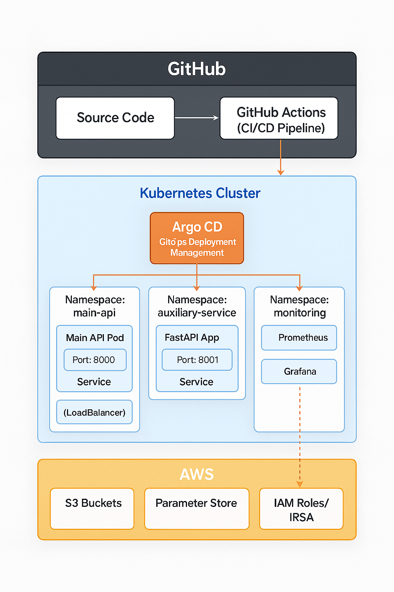
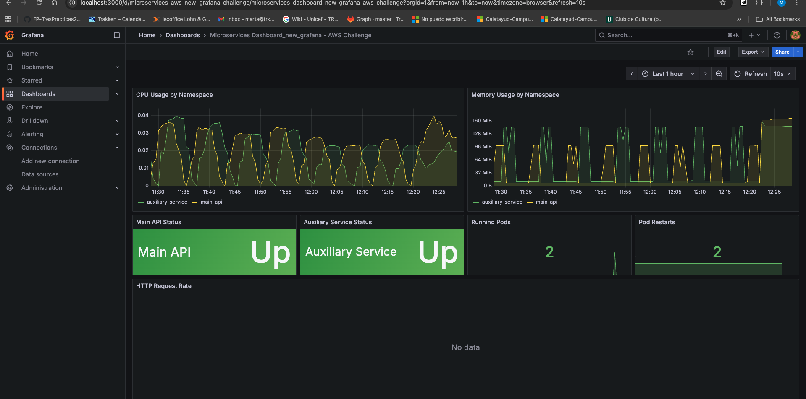
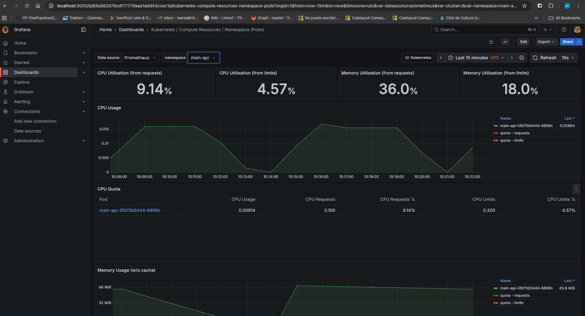
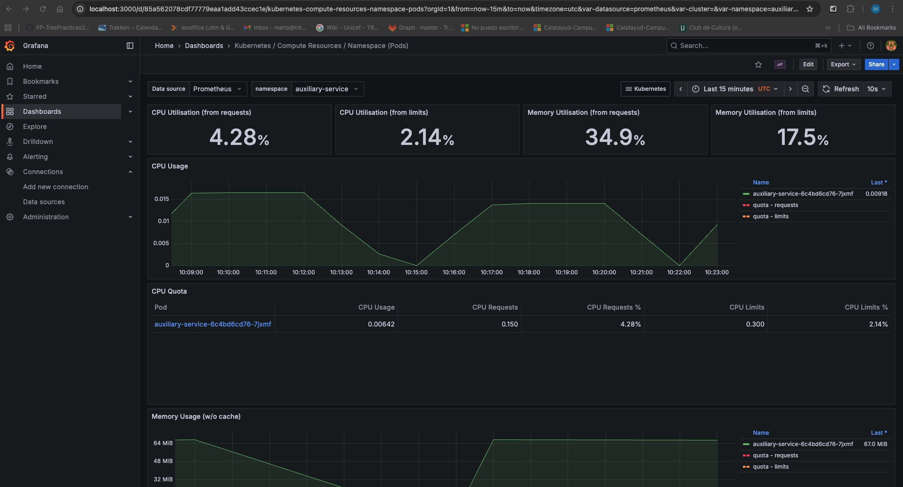

# Kubernetes Deployment with CI/CD & AWS Integration

[](https://github.com/martamateu/aws-challenge/actions)

## 📋 Table of Contents

- [Project Description](#project-description)
- [Architecture](#architecture)
- [Prerequisites](#prerequisites)
- [Project Structure](#project-structure)
- [Setup Guide](#setup-guide)
- [Deployment](#deployment)
- [API Testing](#api-testing)
- [Monitoring](#monitoring)
- [Troubleshooting](#troubleshooting)

## 📖 Project Description

This project implements a microservices architecture on Kubernetes that interacts with AWS, using best practices for Cloud Engineering, CI/CD, and GitOps.

### Main Components

1. **Main API**: REST API that exposes endpoints to list AWS resources
2. **Auxiliary Service**: Backend service that handles interactions with AWS S3 and Parameter Store
3. **Infrastructure**: Defined as code using Terraform
4. **CI/CD**: Complete automation with GitHub Actions using OIDC
5. **GitOps**: Declarative deployment with Argo CD
6. **Observability**: Monitoring with Prometheus and Grafana

## 🏗️ Architecture



### Architecture Flow

1. **GitHub**: Source code and CI/CD Pipeline with GitHub Actions
2. **Kubernetes Cluster**: Microservices orchestration
   - **Argo CD**: GitOps for deployment management
   - **Namespace main-api**: Main API Pod with Service (LoadBalancer) on port 8000
   - **Namespace auxiliary-service**: FastAPI App on port 8001 with AWS SDK
   - **Namespace monitoring**: Prometheus and Grafana for observability
3. **AWS**: Cloud infrastructure
   - **S3 Buckets**: Storage for data, logs, and backups
   - **Parameter Store**: Centralized configuration management
   - **IAM Roles/IRSA**: Secure authentication and authorization

## 🔧 Prerequisites

### Required Tools

- **Docker**: v20.10+
- **kubectl**: v1.28+
- **Terraform**: v1.5+
- **Helm**: v3.12+
- **AWS CLI**: v2.13+
- **Kind/Minikube/K3s**: For local Kubernetes cluster

### Accounts and Access

- AWS account with administrator permissions
- GitHub account
- (Optional) Docker Hub account or Amazon ECR access

## 📁 Project Structure

```
aws-challenge/
├── .github/
│   └── workflows/
│       ├── ci-cd.yml                 # Main CI/CD pipeline
│       └── terraform.yml             # Infrastructure pipeline
├── services/
│   ├── main-api/
│   │   ├── app/
│   │   │   ├── __init__.py
│   │   │   ├── main.py              # FastAPI application
│   │   │   ├── config.py            # Configuration
│   │   │   └── routers/
│   │   │       └── aws_resources.py # AWS endpoints
│   │   ├── Dockerfile
│   │   ├── requirements.txt
│   │   └── tests/
│   └── auxiliary-service/
│       ├── app/
│       │   ├── __init__.py
│       │   ├── main.py              # FastAPI application
│       │   ├── config.py
│       │   └── services/
│       │       └── aws_service.py   # AWS SDK interactions
│       ├── Dockerfile
│       ├── requirements.txt
│       └── tests/
├── terraform/
│   ├── main.tf                       # Main configuration
│   ├── variables.tf
│   ├── outputs.tf
│   ├── versions.tf
│   └── modules/
│       ├── s3/
│       │   ├── main.tf
│       │   ├── variables.tf
│       │   └── outputs.tf
│       ├── parameter-store/
│       │   ├── main.tf
│       │   ├── variables.tf
│       │   └── outputs.tf
│       ├── iam/
│       │   ├── main.tf              # IAM roles, policies, IRSA
│       │   ├── variables.tf
│       │   └── outputs.tf
│       └── github-oidc/
│           ├── main.tf              # GitHub OIDC provider
│           ├── variables.tf
│           └── outputs.tf
├── kubernetes/
│   ├── base/
│   │   ├── namespaces/
│   │   │   ├── main-api.yaml
│   │   │   ├── auxiliary-service.yaml
│   │   │   └── monitoring.yaml
│   │   ├── main-api/
│   │   │   ├── deployment.yaml
│   │   │   ├── service.yaml
│   │   │   ├── configmap.yaml
│   │   │   └── serviceaccount.yaml
│   │   └── auxiliary-service/
│   │       ├── deployment.yaml
│   │       ├── service.yaml
│   │       ├── configmap.yaml
│   │       └── serviceaccount.yaml
│   ├── overlays/
│   │   ├── dev/
│   │   └── prod/
│   └── argocd/
│       ├── applications/
│       │   ├── main-api.yaml
│       │   └── auxiliary-service.yaml
│       └── argocd-install.yaml
├── monitoring/
│   ├── prometheus/
│   │   └── values.yaml
│   └── grafana/
│       ├── values.yaml
│       └── dashboards/
│           └── microservices-dashboard.json
├── docs/
│   ├── images/
│   │   ├── architecture.png
│   │   └── screenshots/
│   │       ├── dashboard-grafana.png
│   │       ├── Grafana_Dashboard_main_api.png
│   │       └── Grafana_Dashboard_auxiliary_Service.png
│   ├── SETUP.md                      # Detailed setup guide
│   ├── API.md                        # API documentation
│   ├── TERRAFORM.md                  # Terraform documentation
│   ├── TESTING.md                    # Testing guide
│   └── AWS-SETUP.md                  # AWS configuration guide
└── README.md
```

## 🚀 Setup Guide

### 1. Local Environment Setup

#### Clone the repository

```bash
git clone https://github.com/your-github-username/aws-challenge.git
cd aws-challenge
```

#### Configure AWS

```bash
aws configure  # Enter your credentials (Access Key ID, Secret Access Key, region)
```

#### Create local Kubernetes cluster (using Kind)

```bash
# Install Kind
brew install kind  # macOS

# Create cluster
kind create cluster --name aws-challenge --config kind-config.yaml

# Verify
kubectl cluster-info
kubectl get nodes
```

### 2. Deploy Infrastructure with Terraform

```bash
cd terraform

# Initialize Terraform
terraform init

# Plan changes
terraform plan -var="region=your-aws-region" -var="environment=dev"

# Apply changes
terraform apply -var="region=your-aws-region" -var="environment=dev"
```

### 3. Install Argo CD

```bash
# Create namespace
kubectl create namespace argocd

# Install Argo CD
kubectl apply -n argocd -f https://raw.githubusercontent.com/argoproj/argo-cd/stable/manifests/install.yaml

# Wait for all pods to be ready
kubectl wait --for=condition=Ready pods --all -n argocd --timeout=300s

# Get initial password
kubectl -n argocd get secret argocd-initial-admin-secret -o jsonpath="{.data.password}" | base64 -d

# Port forward to access the UI
kubectl port-forward svc/argocd-server -n argocd 8080:443

# Access https://localhost:8080
# Username: admin
# Password: (obtained above)
```

### 5. Deploy Applications with Argo CD

```bash
# Apply Argo CD Applications
kubectl apply -f kubernetes/argocd/applications/

# Verify status
kubectl get applications -n argocd

# Sync applications
argocd app sync main-api
argocd app sync auxiliary-service
```

### 6. Install Monitoring Stack (Optional)

```bash
# Add Helm repo
helm repo add prometheus-community https://prometheus-community.github.io/helm-charts
helm repo update

# Install Prometheus & Grafana (kube-prometheus-stack)
helm install kube-prometheus-stack prometheus-community/kube-prometheus-stack \
  --namespace monitoring \
  --create-namespace \
  --set prometheus.prometheusSpec.serviceMonitorSelectorNilUsesHelmValues=false

# Wait for all pods to be ready (takes 2-3 minutes)
kubectl wait --for=condition=Ready pods --all -n monitoring --timeout=300s

# Verify installation
kubectl get pods -n monitoring

# Get Grafana password
kubectl get secret -n monitoring kube-prometheus-stack-grafana \
  -o jsonpath="{.data.admin-password}" | base64 -d && echo

# Access Grafana
kubectl port-forward -n monitoring svc/kube-prometheus-stack-grafana 3000:80
# Then open: http://localhost:3000
# Username: admin
# Password: (from command above, default: prom-operator)

# Access Prometheus (optional)
kubectl port-forward -n monitoring svc/kube-prometheus-stack-prometheus 9090:9090
# Then open: http://localhost:9090
```

## 🧪 API Testing

### Verify services are running

```bash
# Check pods
kubectl get pods -n main-api
kubectl get pods -n auxiliary-service

# Get services
kubectl get svc -n main-api
```

### Access Main API

```bash
# Port forward
kubectl port-forward -n main-api svc/main-api-service 8000:80

# Or if using LoadBalancer
export MAIN_API_URL=$(kubectl get svc -n main-api main-api-service -o jsonpath='{.status.loadBalancer.ingress[0].ip}')
```

### Request Examples

#### 1. Health Check

```bash
curl http://localhost:8000/health
```

**Expected response:**
```json
{
  "status": "healthy",
  "main_api_version": "1.0.0",
  "auxiliary_service_version": "1.0.0",
  "timestamp": "2025-10-24T10:30:00Z"
}
```

#### 2. List all S3 Buckets

```bash
curl http://localhost:8000/api/v1/s3/buckets
```

**Expected response:**
```json
{
  "buckets": [
    {
      "name": "aws-challenge-data-dev",
      "creation_date": "2025-10-24T08:00:00Z"
    },
    {
      "name": "aws-challenge-logs-dev",
      "creation_date": "2025-10-24T08:00:00Z"
    },
    {
      "name": "aws-challenge-backups-dev",
      "creation_date": "2025-10-24T08:00:00Z"
    }
  ],
  "count": 3,
  "main_api_version": "1.0.0",
  "auxiliary_service_version": "1.0.0"
}
```
#### 3. List all Parameter Store parameters

```bash
curl http://localhost:8000/api/v1/parameters
```

**Expected response:**
```json
{
  "parameters": [
    {
      "name": "/aws-challenge/dev/database/host",
      "type": "String",
      "last_modified": "2025-10-24T08:00:00Z"
    },
    {
      "name": "/aws-challenge/dev/api/key",
      "type": "SecureString",
      "last_modified": "2025-10-24T08:00:00Z"
    }
  ],
  "count": 2,
  "main_api_version": "1.0.0",
  "auxiliary_service_version": "1.0.0"
}
```

#### 4. Get value of a specific parameter

```bash
curl http://localhost:8000/api/v1/parameters/value?name=/aws-challenge/dev/database/host
```

**Expected response:**
```json
{
  "name": "/aws-challenge/dev/database/host",
  "value": "db.example.com",
  "type": "String",
  "version": 1,
  "main_api_version": "1.0.0",
  "auxiliary_service_version": "1.0.0"
}
```

### Testing with versions in Headers

All responses also include custom headers:

```bash
curl -I http://localhost:8000/health
```

```
HTTP/1.1 200 OK
X-Main-API-Version: 1.0.0
X-Auxiliary-Service-Version: 1.0.0
Content-Type: application/json
```

## 📊 Monitoring

### Access Prometheus

```bash
kubectl port-forward -n monitoring svc/kube-prometheus-stack-prometheus 9090:9090
```

Open http://localhost:9090

**Example queries:**
- `main_api_requests_total` - Total API requests
- `main_api_request_duration_seconds` - Request latency
- `up{namespace="main-api"}` - Service availability

### Access Grafana

```bash
kubectl port-forward -n monitoring svc/kube-prometheus-stack-grafana 3000:80
```

Open http://localhost:3000

**Credentials:**
- Username: `admin`
- Password: `prom-operator` (get with: `kubectl get secret -n monitoring kube-prometheus-stack-grafana -o jsonpath="{.data.admin-password}" | base64 -d`)

**Available metrics:**
- Kubernetes cluster monitoring (pre-installed dashboards)
- Microservices performance metrics
- API request/response times
- Pod resource usage (CPU, memory)

### ServiceMonitors

The project includes ServiceMonitors for automatic metrics discovery:
- `kubernetes/monitoring/servicemonitor-main-api.yaml` - Scrapes main-api `/metrics`
- `kubernetes/monitoring/servicemonitor-auxiliary-service.yaml` - Scrapes auxiliary-service `/metrics`

### Screenshots

**Grafana Dashboard - Overview**



**Main API Metrics**



**Auxiliary Service Metrics**



## 🔒 Security

### AWS Authentication

This project uses **IRSA (IAM Roles for Service Accounts)** for secure authentication:

1. No hardcoded credentials
2. Pods assume IAM roles through Kubernetes service accounts
3. GitHub Actions uses OIDC to avoid storing static credentials

### Secrets Management

- AWS secrets managed by AWS Secrets Manager / Parameter Store
- ConfigMaps only for non-sensitive configuration
- Service Accounts with minimal necessary permissions (Principle of Least Privilege)

## 🔄 CI/CD Pipeline

The GitHub Actions pipeline performs:

1. **Build**: Builds Docker images for both services
2. **Test**: Runs unit and integration tests
3. **Push**: Pushes images to registry with semantic tags
4. **Update**: Updates Kubernetes manifests with new version
5. **Deploy**: Argo CD detects changes and deploys automatically

### Pipeline Trigger

```bash
# Any push to main triggers the pipeline
git add .
git commit -m "feat: new feature"
git push origin main
```

## 🐛 Troubleshooting

### Common Issues

**Pods in CrashLoopBackOff**
```bash
# Check logs
kubectl logs -n main-api <pod-name>

# Common cause: Missing AWS credentials in pods
# Solution: Ensure IRSA is configured or use local Docker Compose for testing
```

**ImagePullBackOff**
```bash
# Use local images for Kind
kind load docker-image main-api:latest --name aws-challenge
kind load docker-image auxiliary-service:latest --name aws-challenge
```

**Port already in use**
```bash
# Find and kill process using the port
lsof -ti:8000 | xargs kill -9
```

## 📝 License

MIT License

## 👤 Author

Marta Mateu - Cloud Engineer Challenge for Kantox

---

**Questions or suggestions?** Open an issue in this repository.
